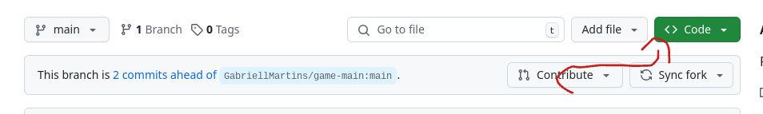
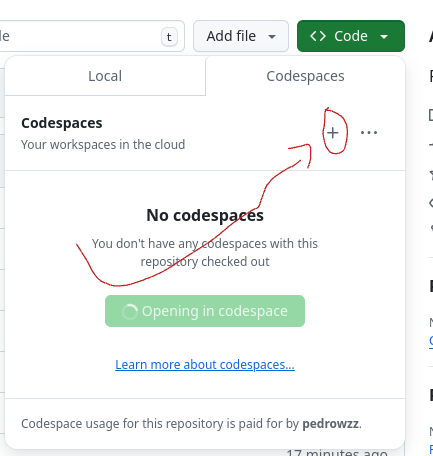
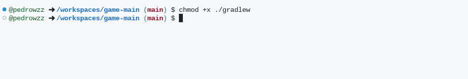
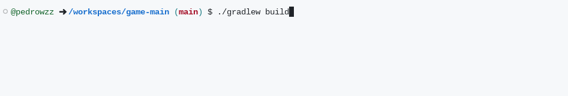
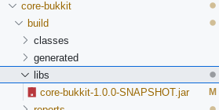

# Game-main
FORK COM TODOS OS ERROS CORRIGIDOS do YOLOMC

Passo a passo para compilar, ou transformar o codigo em .jar (para iniciantes)

Passo 1

Passo 2

Passo 3 (digite esse comand no console: "chmod +x ./gradlew")

Passo 4 (digite esse comand no console, servirá para limpar os jars antigos: "./gradlew clean")

Passo 5 (digite esse comand no console, servirá para gerar os jars novos: "./gradlew build")

Por fim o plugin está compilado e pronto para uso, seus jars estão em caminhos relativos iguais a esse. (Este é o exemplo do CORE: core-bukkit/build/libs/core-bukkit-1.0.0-SNAPSHOT.jar)

ImanitySpigot utilizado foi de um repositório público.
https://repo.imanity.dev/#/imanity-libraries/org/imanity/imanityspigot/api/2021.09.2b5